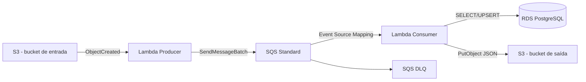

# Atividade 6 — Pipeline em Cloud Computing com S3, Lambda, SQS e PostgreSQL

## 1. Objetivo

Implementar, na AWS, um pipeline orientado a eventos com o fluxo:

**Amazon S3 (entrada) → AWS Lambda produtora → Amazon SQS → AWS Lambda consumidora → PostgreSQL (enriquecimento) → Amazon S3 (saída)**

A solução foi desenhada para atender ao enunciado da Atividade 6 da disciplina de Ingestão de Dados e Pipeline.

## 2. Interpretação do enunciado

O enunciado denomina a primeira função como "Consumidor", embora essa função leia objetos do S3 e envie mensagens à fila. Arquiteturalmente ela exerce o papel de **produtora**. A segunda função é a **consumidora**, pois recebe mensagens da fila SQS, consulta o banco SQL, enriquece os dados e persiste o resultado no S3.

## 3. Arquitetura proposta



### Componentes

- **S3 de entrada:** recebe arquivos CSV.
- **Lambda Producer:** lê o arquivo enviado ao S3 e publica uma mensagem SQS para cada linha.
- **SQS Standard:** desacopla produção e consumo e absorve picos.
- **Lambda Consumer:** recebe mensagens em lote, normaliza CNPJ, consulta o PostgreSQL e cria o registro enriquecido.
- **RDS PostgreSQL:** armazena a dimensão de enriquecimento.
- **S3 de saída:** armazena os registros processados em JSON.
- **DLQ:** recebe mensagens que excederem o número máximo de tentativas.

## 4. Organização dos dados

A solução utiliza dois prefixos no bucket de entrada:

- `referencia/`: arquivos usados para alimentar a tabela de enriquecimento;
- `eventos/`: registros transacionais a serem enriquecidos.

A ordem recomendada para a demonstração é:

1. enviar primeiro `sample/referencia/referencia.csv`;
2. aguardar o processamento;
3. enviar `sample/eventos/eventos.csv`;
4. verificar os arquivos JSON no bucket de saída.

## 5. Estrutura do projeto

```text
C3-Trabalho-Ingestao-Pipeline-Atividade6/
├── docs/
│   ├── 01_solucao_proposta.md
│   └── 02_roteiro_evidencias.md
├── evidencias/
│   └── .gitkeep
├── infra/
│   ├── main.tf
│   ├── outputs.tf
│   ├── terraform.tfvars.example
│   ├── variables.tf
│   └── versions.tf
├── lambdas/
│   ├── consumer/
│   │   ├── lambda_function.py
│   │   └── requirements.txt
│   └── producer/
│       └── lambda_function.py
├── sample/
│   ├── eventos/eventos.csv
│   └── referencia/referencia.csv
├── scripts/
│   ├── build_lambdas.ps1
│   ├── deploy.ps1
│   ├── destroy.ps1
│   └── teste_pipeline.ps1
├── .gitignore
└── README.md
```

## 6. Pré-requisitos

No Windows 11 / PowerShell:

```powershell
terraform --version
aws --version
python --version
```

Recomenda-se Python 3.11+ apenas para empacotamento local. As Lambdas utilizam runtime Python 3.12.

Configure a AWS CLI:

```powershell
aws configure
aws sts get-caller-identity
```

## 7. Construir os pacotes das Lambdas

A partir da raiz do projeto:

```powershell
Set-ExecutionPolicy -Scope Process Bypass
.\scripts\build_lambdas.ps1
```

O processo cria:

```text
dist\producer.zip
dist\consumer.zip
```

## 8. Configurar Terraform

Entre em `infra`:

```powershell
cd .\infra
Copy-Item .\terraform.tfvars.example .\terraform.tfvars
notepad .\terraform.tfvars
```

Defina uma senha forte para o PostgreSQL em `terraform.tfvars`.

> Para ambiente acadêmico, a senha é enviada à Lambda por variável de ambiente. Em ambiente de produção, recomenda-se AWS Secrets Manager e rotação de credenciais.

## 9. Provisionar infraestrutura

```powershell
terraform init
terraform fmt
terraform validate
terraform plan -out tfplan
terraform apply tfplan
```

Ou, a partir da raiz:

```powershell
.\scripts\deploy.ps1
```

Ao final, o Terraform informa os nomes dos buckets, da fila SQS e o endpoint do RDS.

## 10. Testar o pipeline

Volte à raiz do projeto e execute:

```powershell
.\scripts\teste_pipeline.ps1
```

O script:

1. consulta os outputs do Terraform;
2. envia `referencia.csv` para `referencia/`;
3. aguarda alguns segundos;
4. envia `eventos.csv` para `eventos/`;
5. lista os objetos produzidos no bucket de saída.

Também é possível executar manualmente:

```powershell
$INPUT_BUCKET = terraform -chdir=infra output -raw input_bucket_name
aws s3 cp .\sample\referencia\referencia.csv "s3://$INPUT_BUCKET/referencia/referencia.csv"
aws s3 cp .\sample\eventos\eventos.csv "s3://$INPUT_BUCKET/eventos/eventos.csv"
```

## 11. Resultado esperado

A referência de exemplo contém CNPJs associados a categoria e descrição. Quando um evento com CNPJ correspondente for consumido, o JSON de saída apresentará:

```json
{
  "cnpj": "11111111000191",
  "protocolo": "REC-0001",
  "valor": "150.00",
  "cnpj_norm": "11111111000191",
  "enriquecimento_encontrado": true,
  "categoria": "Servicos",
  "descricao": "Empresa Exemplo A"
}
```

Quando não houver correspondência no PostgreSQL, o campo `enriquecimento_encontrado` será `false`.

## 12. Características técnicas importantes

### Idempotência

- Referências utilizam `INSERT ... ON CONFLICT DO UPDATE`.
- O arquivo processado usa o `messageId` do SQS no nome do objeto, reduzindo efeitos de reprocessamento.

### Tratamento parcial de falhas

A Lambda consumidora retorna `batchItemFailures`, e o mapeamento SQS/Lambda é configurado com `ReportBatchItemFailures`.

### Dead-letter queue

A fila principal possui política de redrive para uma DLQ após tentativas malsucedidas.

### Separação entre entrada e saída

São usados buckets distintos para evitar que a própria gravação de saída dispare novamente a Lambda de entrada.

## 13. Evidências sugeridas para entrega

Salvar capturas em `evidencias/`:

1. Terraform `apply` concluído.
2. Buckets S3 criados.
3. Arquivo `referencia.csv` no S3.
4. Arquivo `eventos.csv` no S3.
5. Fila SQS e DLQ.
6. Trigger S3 da Lambda Producer.
7. Trigger SQS da Lambda Consumer.
8. Logs da Lambda Producer.
9. Logs da Lambda Consumer.
10. Objetos JSON no bucket de saída.
11. Conteúdo de um JSON enriquecido.
12. Consulta/registro no RDS PostgreSQL, se desejado.

## 14. Encerrar os recursos

Para evitar custos:

```powershell
.\scripts\destroy.ps1
```

ou:

```powershell
terraform -chdir=infra destroy
```

## 15. Referências técnicas

Amazon Web Services. (2026). *Process Amazon S3 event notifications with Lambda*. AWS Lambda Developer Guide. DOI: não atribuído.

Amazon Web Services. (2026). *Using Lambda with Amazon SQS*. AWS Lambda Developer Guide. DOI: não atribuído.

Amazon Web Services. (2026). *Creating and configuring an Amazon SQS event source mapping*. AWS Lambda Developer Guide. DOI: não atribuído.
