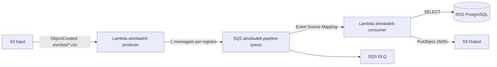

# Atividade 6 — Pipeline em Cloud Computing com S3, Lambda, SQS e PostgreSQL

## 1. Objetivo

Implementar e validar na AWS um pipeline orientado a eventos com o fluxo:

**Amazon S3 (entrada) → AWS Lambda Producer → Amazon SQS → AWS Lambda Consumer → Amazon RDS PostgreSQL (enriquecimento) → Amazon S3 (saída)**

A solução foi executada e validada ponta a ponta em 16/09/2026 na região `us-east-2`.

## 2. Método de implementação

A infraestrutura utilizada no desenvolvimento e na validação desta atividade foi configurada diretamente na AWS por meio do **AWS CloudShell e da AWS CLI**. Foram criados e configurados dessa forma os buckets S3, filas SQS e DLQ, funções Lambda, permissões IAM, integrações S3 → Lambda e SQS → Lambda, RDS PostgreSQL, VPC, sub-redes e Security Group.

A pasta `infra/` contém uma representação **opcional** em Terraform para fins de estudo e reprodutibilidade. Esses arquivos não foram utilizados para provisionar a infraestrutura que originou as evidências apresentadas neste trabalho. Da mesma forma, `scripts/deploy.ps1` e `scripts/destroy.ps1` pertencem apenas a essa alternativa opcional.

## 3. Arquitetura implementada



### Componentes validados

- Bucket de entrada: `atividade6-input-041525320433-us-east-2`
- Bucket de saída: `atividade6-output-041525320433-us-east-2`
- Lambda Producer: `atividade6-producer`
- Fila principal: `atividade6-pipeline-queue`
- DLQ: `atividade6-pipeline-dlq`
- Lambda Consumer: `atividade6-consumer`
- RDS PostgreSQL: `atividade6-postgres`
- Runtime das Lambdas: Python 3.12

## 4. Funcionamento

1. Um arquivo CSV é enviado para o prefixo `eventos/` no bucket de entrada.
2. O S3 aciona automaticamente a Lambda Producer.
3. A Producer lê o CSV, identifica o delimitador e publica uma mensagem SQS para cada linha.
4. O SQS aciona a Lambda Consumer por meio de Event Source Mapping.
5. A Consumer normaliza o CNPJ, consulta a tabela `dim_enriquecimento` no PostgreSQL e monta o registro enriquecido.
6. Cada resultado é persistido em JSON no bucket de saída, no prefixo `processed/YYYY/MM/DD/`.
7. Mensagens que falharem repetidamente são encaminhadas para a DLQ.

## 5. Teste ponta a ponta validado

```csv
protocolo,cnpj,valor
REC-E2E-001,11.111.111/0001-91,150.00
REC-E2E-002,22.222.222/0001-82,320.50
REC-E2E-003,99.999.999/0001-99,80.00
```

| Protocolo | Enriquecimento | Categoria | Descrição |
|---|---|---|---|
| REC-E2E-001 | encontrado | Servicos | Empresa Exemplo A |
| REC-E2E-002 | encontrado | Comercio | Empresa Exemplo B |
| REC-E2E-003 | não encontrado | null | null |

Indicadores finais:

- 3 mensagens produzidas;
- 3 mensagens processadas;
- 0 mensagens remanescentes na fila principal;
- 0 mensagens na DLQ;
- 3 novos arquivos JSON no S3 Output.

## 6. Estrutura do projeto

```text
C3-Trabalho-Ingestao-Pipeline-Atividade7/
├── docs/
├── evidencias/
├── infra/                 # Terraform opcional; não usado na execução validada
├── lambdas/
├── sample/
├── scripts/
├── .gitignore
└── README.md
```

## 7. Evidências

A pasta `evidencias/` contém o relatório consolidado, manifesto, logs sanitizados, scripts de coleta, evidência do PostgreSQL e registro do teste ponta a ponta. As evidências correspondem à execução realizada por AWS CloudShell/AWS CLI.

## 8. Segurança

Não versionar arquivos `.env`, configurações contendo credenciais, Access Keys AWS, senhas do PostgreSQL ou chaves privadas. O arquivo `infra/terraform.tfvars`, caso seja criado para experimentar a alternativa Terraform, também não deve ser versionado.

## 9. Sincronização local

```powershell
cd "D:\GitHub\C3-Trabalho-Ingestao-Pipeline-Atividade7"
git remote set-url origin https://github.com/brtostes/C3-Trabalho-Ingestao-Pipeline-Atividade7.git
git fetch origin
git pull --ff-only origin main
```

## 10. Resultado final

O pipeline foi validado de forma integrada, comprovando o processamento automático desde a entrada do CSV no S3 até a persistência dos registros enriquecidos no bucket de saída, utilizando SQS para desacoplamento e PostgreSQL para enriquecimento dos dados.
