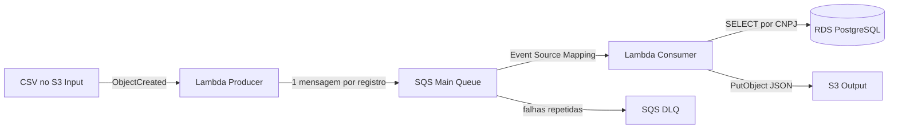

# Atividade 7 — Pipeline em Cloud Computing - Streaming (AWS)

## Visão geral

> **Contexto atual — Atividade 7 (19/09/2026):** este repositório passa a ser utilizado como base da Atividade 7 da disciplina de Ingestão de Dados. O enunciado exige o fluxo **S3 → Lambda produtora → SQS → Lambda consumidora com consulta SQL → S3**. A implementação existente já materializa esse fluxo e será reaproveitada para reduzir retrabalho no ambiente AWS Try Catch Finally. Os recursos AWS ainda possuem o prefixo `atividade6-` porque foram provisionados e validados anteriormente; antes da entrega da Atividade 7 será executado um novo teste ponta a ponta e serão registradas evidências específicas da Atividade 7.

> Plano de execução incremental: `docs/00_plano_atividade7_passo_a_passo.md`.

Esta atividade teve como objetivo implementar e validar, em ambiente AWS, um pipeline orientado a eventos capaz de receber arquivos CSV, transformar cada registro em uma mensagem, processá-la de forma desacoplada, realizar enriquecimento a partir de uma base PostgreSQL e persistir o resultado novamente no Amazon S3.

O fluxo validado foi:

**Amazon S3 (entrada) → AWS Lambda Producer → Amazon SQS → AWS Lambda Consumer → Amazon RDS PostgreSQL → Amazon S3 (saída)**

A implementação foi executada e testada ponta a ponta em **16/09/2026**, na região **`us-east-2`**, utilizando principalmente **AWS CloudShell e AWS CLI**.

> Os arquivos Terraform existentes no repositório representam uma alternativa de infraestrutura como código e servem como material complementar/reprodutível. O provisionamento utilizado na execução que originou as evidências desta atividade foi realizado diretamente por comandos AWS CLI no CloudShell.

---

## 1. Objetivos técnicos

A solução foi desenvolvida para demonstrar os seguintes conceitos:

- ingestão de arquivos no Amazon S3;
- arquitetura orientada a eventos;
- funções serverless com AWS Lambda;
- desacoplamento entre produção e consumo com Amazon SQS;
- uso de Dead-Letter Queue (DLQ);
- acesso de Lambda a banco PostgreSQL em Amazon RDS;
- enriquecimento de dados por consulta SQL;
- gravação de resultados processados em S3;
- tratamento de falhas por mensagem;
- observabilidade por meio do Amazon CloudWatch Logs;
- configuração de IAM, VPC, sub-redes, Security Group e endpoint S3.

---

## 2. Arquitetura implementada



### Recursos validados

| Componente | Recurso utilizado |
|---|---|
| Região AWS | `us-east-2` |
| S3 Input | `atividade6-input-041525320433-us-east-2` |
| S3 Output | `atividade6-output-041525320433-us-east-2` |
| Lambda Producer | `atividade6-producer` |
| SQS principal | `atividade6-pipeline-queue` |
| SQS DLQ | `atividade6-pipeline-dlq` |
| Lambda Consumer | `atividade6-consumer` |
| RDS PostgreSQL | `atividade6-postgres` |
| IAM Role | `atividade6-lambda-role` |
| Runtime Lambda | Python 3.12 |
| Biblioteca PostgreSQL | `pg8000==1.31.5` |

A fila principal foi configurada com política de redrive para a DLQ, com `maxReceiveCount=5`. O mapeamento SQS → Lambda Consumer utilizou `BatchSize=1` e `ReportBatchItemFailures`.

---

## 3. Etapas do desenvolvimento

### 3.1. Definição da região e das variáveis do ambiente

O desenvolvimento foi realizado no AWS CloudShell. Inicialmente foram definidas variáveis para evitar repetição de nomes e reduzir erros de digitação durante a configuração dos recursos.

Exemplo da organização adotada:

```bash
export REGION="us-east-2"
export INPUT_BUCKET="atividade6-input-041525320433-us-east-2"
export OUTPUT_BUCKET="atividade6-output-041525320433-us-east-2"
export QUEUE_NAME="atividade6-pipeline-queue"
export DLQ_NAME="atividade6-pipeline-dlq"
export PRODUCER_FUNCTION="atividade6-producer"
export CONSUMER_FUNCTION="atividade6-consumer"
export LAMBDA_ROLE_NAME="atividade6-lambda-role"
export RDS_INSTANCE="atividade6-postgres"
```

Também foram obtidas dinamicamente informações como URL e ARN da fila SQS utilizando a AWS CLI.

---

### 3.2. Preparação dos buckets S3

Foram utilizados dois buckets distintos:

- **Input:** responsável pelo recebimento dos arquivos CSV;
- **Output:** responsável pelo armazenamento dos registros enriquecidos em JSON.

A separação entre entrada e saída evita que a gravação de um arquivo processado acione novamente a Lambda Producer e gere um ciclo recursivo.

No bucket de entrada foi utilizado o prefixo:

```text
eventos/
```

A integração S3 → Lambda foi configurada para reagir a eventos `ObjectCreated` apenas para arquivos `.csv` nesse prefixo.

---

### 3.3. Criação da fila SQS e da Dead-Letter Queue

Foi criada uma fila principal para desacoplar o recebimento dos dados do processamento:

```text
atividade6-pipeline-queue
```

Também foi criada uma DLQ:

```text
atividade6-pipeline-dlq
```

A política de redrive foi configurada para encaminhar uma mensagem para a DLQ após sucessivas tentativas malsucedidas, com:

```text
maxReceiveCount = 5
```

Essa configuração permite que falhas persistentes sejam isoladas sem interromper o processamento das demais mensagens.

---

### 3.4. Configuração de IAM

Foi utilizada a role:

```text
atividade6-lambda-role
```

Além das políticas necessárias à execução das Lambdas, foram concedidas permissões específicas para:

- listar o bucket de entrada;
- ler objetos do S3 Input;
- gravar objetos no S3 Output;
- enviar mensagens para a fila SQS;
- consultar atributos da fila;
- executar a Lambda em VPC;
- consumir mensagens SQS;
- registrar logs no CloudWatch.

A política de acesso aos dados foi criada seguindo o princípio de conceder apenas as ações necessárias ao pipeline.

---

### 3.5. Configuração de rede para acesso ao PostgreSQL

A Lambda Consumer precisava acessar o Amazon RDS PostgreSQL, portanto foi configurada dentro da mesma VPC utilizada pelo banco.

Foram verificados:

- VPC;
- sub-redes;
- tabela de rotas;
- Security Group;
- regras de entrada e saída;
- conectividade com o RDS;
- endpoint Gateway do S3.

A Consumer foi associada às três sub-redes disponíveis na VPC e ao Security Group usado no ambiente da atividade.

O RDS permaneceu com:

```text
PubliclyAccessible = false
```

Dessa forma, o banco não precisava ser exposto diretamente à Internet para ser consultado pela Lambda.

---

## 4. Desenvolvimento da Lambda Producer

A função **`atividade6-producer`** foi criada em Python 3.12 com:

- timeout de 60 segundos;
- memória de 256 MB;
- variável de ambiente `QUEUE_URL`;
- trigger automático a partir do S3 Input.

O código está disponível em:

```text
lambdas/producer/lambda_function.py
```

### Responsabilidades da Producer

A função executa as seguintes etapas:

1. recebe o evento `ObjectCreated` do S3;
2. identifica o bucket e a chave do objeto;
3. faz `GetObject` do arquivo CSV;
4. tenta decodificar o arquivo como `UTF-8-SIG`;
5. usa `Latin-1` como contingência em caso de erro de codificação;
6. detecta o delimitador entre `,`, `;`, `|` e tabulação;
7. interpreta o arquivo com `csv.DictReader`;
8. cria uma mensagem JSON para cada registro;
9. inclui metadados de origem, número da linha, encoding e delimitador detectado;
10. envia cada mensagem individualmente para o SQS;
11. registra no CloudWatch o arquivo recebido e os IDs das mensagens enviadas.

Estrutura simplificada de uma mensagem gerada:

```json
{
  "tipo": "evento",
  "source_bucket": "...",
  "source_key": "eventos/arquivo.csv",
  "row_number": 2,
  "encoding_detectado": "utf-8-sig",
  "delimitador_detectado": ",",
  "payload": {
    "protocolo": "REC-E2E-001",
    "cnpj": "11.111.111/0001-91",
    "valor": "150.00"
  },
  "produzido_em": "..."
}
```

Antes do deploy, o código Python foi validado com `py_compile`, compactado em ZIP e enviado à AWS Lambda.

---

## 5. Integração S3 → Lambda Producer

Após a criação da função, foi configurada a permissão para que o Amazon S3 pudesse invocá-la.

A notificação do bucket foi então configurada com:

```text
Evento:  s3:ObjectCreated:*
Prefixo: eventos/
Sufixo:  .csv
```

Assim, qualquer novo CSV gravado no caminho `eventos/` inicia automaticamente o pipeline.

---

## 6. Preparação do PostgreSQL para enriquecimento

O banco de dados utilizado foi uma instância Amazon RDS PostgreSQL.

A tabela consultada pela Consumer foi:

```sql
public.dim_enriquecimento
```

A lógica de enriquecimento utiliza o CNPJ normalizado como chave de pesquisa.

Exemplo dos dados de referência utilizados:

| CNPJ normalizado | Categoria | Descrição |
|---|---|---|
| `11111111000191` | Servicos | Empresa Exemplo A |
| `22222222000182` | Comercio | Empresa Exemplo B |
| `33333333000173` | Industria | Empresa Exemplo C |

O arquivo correspondente está disponível em:

```text
sample/referencia/referencia.csv
```

---

## 7. Desenvolvimento da Lambda Consumer

A função **`atividade6-consumer`** também foi desenvolvida em Python 3.12.

O código está disponível em:

```text
lambdas/consumer/lambda_function.py
```

Como o runtime Lambda não inclui nativamente o driver PostgreSQL utilizado, foi necessário empacotar a dependência:

```text
pg8000==1.31.5
```

O empacotamento foi realizado no CloudShell instalando a biblioteca em uma pasta temporária e adicionando o código `lambda_function.py` ao mesmo pacote ZIP.

### Variáveis de ambiente utilizadas

A Consumer foi configurada com variáveis semelhantes a:

```text
DB_HOST
DB_PORT
DB_NAME
DB_USER
DB_PASSWORD
OUTPUT_BUCKET
```

Nenhuma senha real deve ser armazenada no repositório.

### Responsabilidades da Consumer

Para cada mensagem SQS, a função:

1. desserializa o corpo JSON;
2. obtém o payload enviado pela Producer;
3. identifica protocolo, CNPJ e valor;
4. remove caracteres não numéricos do CNPJ;
5. abre conexão com PostgreSQL por meio do `pg8000`;
6. executa a consulta:

```sql
SELECT categoria, descricao
FROM public.dim_enriquecimento
WHERE cnpj_norm = %s
LIMIT 1;
```

7. identifica se houve correspondência;
8. monta o JSON final enriquecido;
9. adiciona data/hora do processamento;
10. gera uma chave única no S3 Output;
11. grava o resultado usando `PutObject`;
12. registra o processamento no CloudWatch.

Os objetos produzidos seguem a estrutura:

```text
processed/YYYY/MM/DD/<protocolo>-<uuid>.json
```

---

## 8. Integração SQS → Lambda Consumer

Foi criado um **Event Source Mapping** entre a fila principal e a Consumer.

Na validação final foram adotados:

```text
BatchSize = 1
FunctionResponseTypes = ReportBatchItemFailures
```

O lote unitário facilitou a rastreabilidade individual de cada registro durante o teste.

A função foi ajustada para retornar:

```json
{
  "batchItemFailures": []
}
```

quando todas as mensagens forem processadas corretamente.

Em caso de falha de uma mensagem específica, o respectivo `messageId` é incluído em `batchItemFailures`, permitindo retentativa sem tratar todo o lote como malsucedido.

---

## 9. Teste ponta a ponta

Após configurar todos os componentes, foi realizado um teste completo do pipeline.

### Arquivo utilizado

O arquivo de teste foi:

```csv
protocolo,cnpj,valor
REC-E2E-001,11.111.111/0001-91,150.00
REC-E2E-002,22.222.222/0001-82,320.50
REC-E2E-003,99.999.999/0001-99,80.00
```

O arquivo está disponível em:

```text
sample/eventos/eventos.csv
```

No teste registrado em evidência, o arquivo foi enviado ao S3 com a chave:

```text
eventos/eventos-20260916-183840.csv
```

### Resultado observado na Producer

Os logs do CloudWatch mostraram:

- recebimento do arquivo pelo trigger S3;
- envio da linha 2 ao SQS;
- envio da linha 3 ao SQS;
- envio da linha 4 ao SQS;
- total de **3 mensagens enviadas**.

### Resultado observado na Consumer

As três mensagens foram processadas automaticamente:

| Protocolo | CNPJ normalizado | Resultado |
|---|---|---|
| `REC-E2E-001` | `11111111000191` | enriquecimento encontrado |
| `REC-E2E-002` | `22222222000182` | enriquecimento encontrado |
| `REC-E2E-003` | `99999999000199` | sem correspondência |

Para os dois primeiros registros, foram recuperados categoria e descrição do PostgreSQL. O terceiro registro foi preservado normalmente, com `enriquecimento_encontrado=false`.

---

## 10. Validação final

Após o processamento foram realizadas verificações independentes nos componentes da arquitetura.

### SQS principal

Ao final do teste:

```text
ApproximateNumberOfMessages           = 0
ApproximateNumberOfMessagesNotVisible = 0
```

Isso demonstrou que não ficaram mensagens pendentes ou em processamento.

### DLQ

Ao final do teste:

```text
ApproximateNumberOfMessages = 0
```

Portanto, nenhuma das três mensagens precisou ser encaminhada à fila de erros.

### S3 Output

A quantidade de objetos na pasta `processed/` foi comparada antes e depois do teste:

```text
Antes:  1
Depois: 4
Novos:  3
```

Foram, portanto, criados exatamente três novos objetos JSON, um para cada registro de entrada.

---

## 11. Resultado funcional

| Protocolo | Enriquecimento | Categoria | Descrição |
|---|---|---|---|
| `REC-E2E-001` | Sim | Servicos | Empresa Exemplo A |
| `REC-E2E-002` | Sim | Comercio | Empresa Exemplo B |
| `REC-E2E-003` | Não | `null` | `null` |

O comportamento do terceiro registro é proposital: a ausência de correspondência na dimensão não é tratada como erro técnico do pipeline.

---

## 12. Estrutura do repositório

```text
C3-Trabalho-Ingestao-Pipeline-Atividade7/
├── docs/
│   ├── 01_solucao_proposta.md
│   └── 02_roteiro_evidencias.md
├── evidencias/
│   ├── Manifesto_Evidencias_Atividade6.csv
│   ├── README_EVIDENCIAS.md
│   ├── Relatorio_Evidencias_Atividade6_AWS.docx
│   ├── logs/
│   │   ├── 01_execucao_infraestrutura_e_producer_sanitizado.txt
│   │   ├── 02_criacao_consumer_e_autenticacao_sanitizado.txt
│   │   └── 03_teste_ponta_a_ponta_sanitizado.txt
│   └── scripts/
├── infra/
│   ├── main.tf
│   ├── outputs.tf
│   ├── terraform.tfvars.example
│   ├── variables.tf
│   └── versions.tf
├── lambdas/
│   ├── producer/
│   │   └── lambda_function.py
│   └── consumer/
│       ├── lambda_function.py
│       └── requirements.txt
├── sample/
│   ├── eventos/
│   │   └── eventos.csv
│   └── referencia/
│       └── referencia.csv
├── scripts/
│   ├── build_lambdas.ps1
│   ├── deploy.ps1
│   ├── destroy.ps1
│   └── teste_pipeline.ps1
├── .gitignore
└── README.md
```

---

## 13. Evidências

A pasta `evidencias/` reúne os registros utilizados para comprovar o desenvolvimento e a execução da atividade.

Entre as evidências estão:

- configuração da infraestrutura AWS;
- criação e configuração da Lambda Producer;
- criação e empacotamento da Lambda Consumer;
- instalação do `pg8000`;
- integração S3 → Lambda;
- integração SQS → Lambda;
- configuração da fila principal e da DLQ;
- configuração do RDS e da rede;
- logs CloudWatch da Producer;
- logs CloudWatch da Consumer;
- resultado do teste ponta a ponta;
- validação das filas após o processamento;
- comprovação dos objetos gerados no S3 Output.

Os logs versionados foram sanitizados para não expor a senha utilizada no PostgreSQL.

---

## 14. Segurança

Não devem ser versionados:

- senhas do PostgreSQL;
- Access Key ID e Secret Access Key da AWS;
- arquivos `.env`;
- arquivos `*environment*.json` contendo segredos;
- `terraform.tfvars` com credenciais;
- chaves privadas (`.pem`, `.key`).

Durante a atividade a senha do banco foi fornecida à Lambda por variável de ambiente. Para um ambiente de produção, uma evolução recomendada seria utilizar **AWS Secrets Manager** ou mecanismo equivalente de gerenciamento de segredos.

---

## 15. Principais decisões arquiteturais

### Uso do SQS

O SQS desacopla a leitura do arquivo do processamento dos registros. A Producer pode publicar mensagens independentemente da velocidade de processamento da Consumer.

### Uma mensagem por linha

Cada linha do CSV é tratada como uma unidade independente de processamento, facilitando retentativas, rastreabilidade e isolamento de falhas.

### DLQ

A DLQ evita que mensagens persistentemente inválidas permaneçam indefinidamente na fila principal.

### RDS privado

A instância PostgreSQL não foi exposta publicamente. A conectividade foi realizada por meio da configuração de VPC da Lambda Consumer.

### `ReportBatchItemFailures`

Essa opção permite informar especificamente quais mensagens falharam, evitando reprocessamento desnecessário de mensagens bem-sucedidas.

### Dois buckets S3

A separação entre entrada e saída evita recursão acidental do evento de criação de objetos.

---

## 16. Critérios de aceite atendidos

A atividade foi considerada validada porque foram comprovados:

- upload de CSV no S3 Input;
- acionamento automático da Lambda Producer;
- criação de três mensagens SQS;
- acionamento automático da Lambda Consumer;
- conexão da Consumer com o RDS PostgreSQL;
- consulta SQL por CNPJ;
- enriquecimento de registros com correspondência;
- tratamento normal de registro sem correspondência;
- criação de três JSONs no S3 Output;
- fila principal vazia ao final;
- DLQ vazia ao final;
- ausência de erros no teste ponta a ponta.

---

## 17. Sincronização local

Repositório:

```text
https://github.com/brtostes/C3-Trabalho-Ingestao-Pipeline-Atividade7
```

Para atualizar a cópia local:

```powershell
cd "D:\GitHub\C3-Trabalho-Ingestao-Pipeline-Atividade7"
git remote set-url origin https://github.com/brtostes/C3-Trabalho-Ingestao-Pipeline-Atividade7.git
git fetch origin
git pull --ff-only origin main
```

---

## 18. Conclusão

O desenvolvimento comprovou o funcionamento integrado de uma arquitetura orientada a eventos na AWS. O arquivo CSV inserido no S3 foi convertido em mensagens individuais, desacopladas pelo SQS, processadas por uma Lambda Consumer com acesso a um banco PostgreSQL privado e enriquecidas antes de serem persistidas novamente em S3.

O teste final demonstrou o processamento completo dos três registros, incluindo dois casos com enriquecimento encontrado e um caso sem correspondência, sem deixar mensagens pendentes na fila principal e sem encaminhar mensagens para a DLQ. Dessa forma, o pipeline cumpriu o fluxo funcional proposto e produziu evidências suficientes para demonstrar sua execução ponta a ponta.
